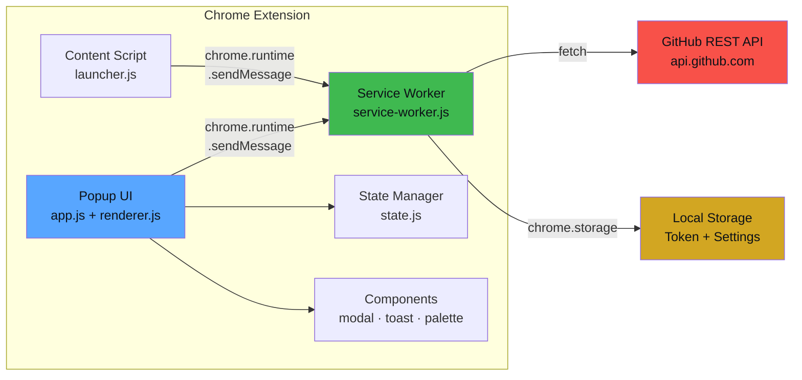
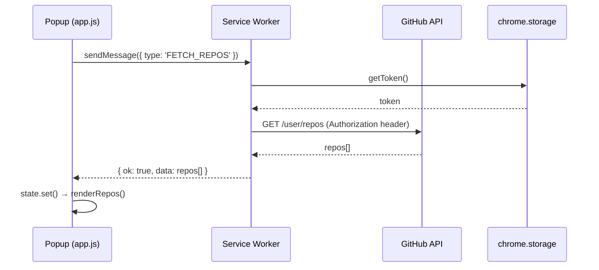
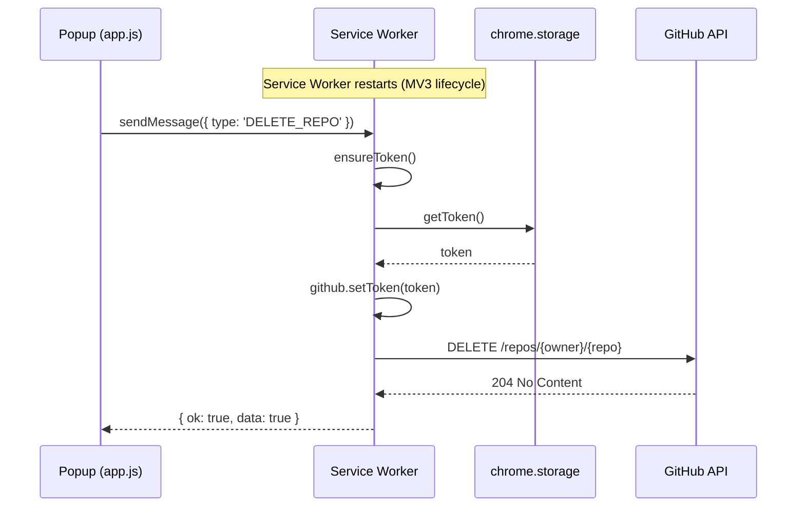

<div align="center">


# ⚒️ ForgeHelm

**The Ultimate Chrome Extension for Bulk GitHub Repository Management**

[](https://github.com/ThanhNguyxn07/ForgeHelm)
[](https://developer.chrome.com/docs/extensions/mv3/)
[](https://docs.github.com/en/rest)
[](LICENSE)

[](https://github.com/ThanhNguyxn07/ForgeHelm/stargazers)
[](https://github.com/ThanhNguyxn07/ForgeHelm/network/members)
[](https://github.com/ThanhNguyxn07/ForgeHelm/issues)
[](CONTRIBUTING.md)

<p align="center">
  <b>Archive · Delete · Transfer · Fork · Manage Topics · Change Visibility</b>
  <br />
  <i>All in one place — right from your browser.</i>
</p>

[🚀 Installation](#-installation) · [✨ Features](#-features) · [📖 Usage](#-usage) · [🏗️ Architecture](#️-architecture) · [🤝 Contributing](#-contributing)

---

</div>

## 🎯 Why ForgeHelm?

Managing dozens (or hundreds) of GitHub repositories is painful. Changing visibility one by one? Archiving old projects manually? Deleting test repos through GitHub's slow confirmation flow?

**ForgeHelm** puts you in the captain's seat — manage all your repos in bulk with a beautiful dark-themed UI that feels native to GitHub.

> 🔥 **ForgeHelm** = **Forge** (create, build, shape) + **Helm** (steering wheel, command center)

---

## ✨ Features

### 🎛️ Core Operations

| Feature | Single | Bulk | Description |
|---------|:------:|:----:|-------------|
| 🔓 Change Visibility | ✅ | ✅ | Toggle between Public / Private |
| 🗑️ Delete Repository | ✅ | ✅ | Permanent deletion with typed confirmation |
| 📦 Archive / Unarchive | ✅ | ✅ | Archive repos to mark as read-only |
| 🏷️ Manage Topics | ✅ | ✅ | Add, remove, or replace repository topics |
| 📤 Transfer Ownership | ✅ | ✅ | Transfer repos to another user or org |
| 🍴 Fork Repository | ✅ | ✅ | Fork to your account or organization |
| 📝 Edit Description | ✅ | ✅ | Update repo descriptions in bulk |

### 🔍 Smart Filtering & Search

- 🔎 **Real-time search** across repo names and descriptions
- 📊 **Filter** by visibility (Public / Private / All)
- 📋 **Filter** by type (Sources / Forks / Archived)
- 🔄 **Sort** by updated date, name, stars, created date, or size
- 🏷️ **Filter by topics** — find repos by their tags

### 🛡️ Safety & Security

- 🔐 **Classic PAT first** — aligned with proven reference workflow (`repo` + `delete_repo`)
- ⚠️ **Typed confirmation** for destructive actions (delete, transfer)
- 🚫 **Busy-lock system** — prevents double-actions on in-progress repos
- 📊 **Rate limit monitoring** — real-time GitHub API quota tracking
- 🔒 **Token stored locally** — never sent anywhere except `api.github.com`
- ♻️ **Retry with exponential backoff** on rate limits
- 🔍 **Smart error detection** — distinguishes rate limits from permission errors

### 🎨 User Experience

- 🌙 **GitHub Dark theme** — seamless integration with GitHub's UI
- 📌 **Floating launcher** — access ForgeHelm from any GitHub page
- 🪟 **Slide-in panel** — no popup, no new tab, just a clean side panel
- 📊 **Progress tracking** — real-time progress bars for bulk operations
- 🔔 **Toast notifications** — non-intrusive success/error feedback
- ⚡ **Skeleton loading** — smooth loading states
- 📋 **Export to JSON/CSV** — download your repo list

---

## 🚀 Installation

### From Source (Developer)

```bash
# 1. Clone the repository
git clone https://github.com/ThanhNguyxn07/ForgeHelm.git
cd ForgeHelm

# 2. Install dependencies
npm install

# 3. Build CSS
npm run build

# 4. Load in Chrome
#    → Open chrome://extensions
#    → Enable "Developer mode"
#    → Click "Load unpacked"
#    → Select the `src/` folder
```

### 🔑 Setting Up Your GitHub Token (Classic PAT First)

ForgeHelm is optimized for **Personal Access Token (classic)** flow, matching the reference repo behavior.

1. Open [GitHub Settings → Developer Settings → Personal access tokens (classic)](https://github.com/settings/tokens)
2. Click **Generate new token (classic)**
3. Set token name and expiration
4. Enable scopes below
5. Generate token and paste it into ForgeHelm

#### 🧪 Built-in Token Check (Test Key)

After you click **Save Token**, ForgeHelm now runs a capability preflight:
- Validates authentication (`/user`)
- Checks detected classic scopes from `X-OAuth-Scopes`
- Reports missing critical scopes (`repo`, `delete_repo`) before destructive actions

If the checker says a scope is missing, regenerate your classic PAT with the required scopes and save again.

#### ✅ Classic PAT Scopes (Recommended)

| Scope | Why it is needed |
|-------|------------------|
| `repo` | Required for listing repos and all write operations (visibility, archive, transfer, fork, topics, edit) |
| `delete_repo` | Required for delete repository API |
| `read:org` | Optional, useful when working with org-owned repositories |

#### 🔐 Required Scopes by Feature (Classic PAT)

> [!IMPORTANT]
> For full ForgeHelm functionality, generate a **classic PAT** with at least `repo` and `delete_repo`.

| Feature | Required classic scope(s) | API Endpoint |
|---------|---------------------------|--------------|
| 📋 List repos | `repo` | `GET /user/repos` |
| 🔍 Search / filter / sort | `repo` | (client-side + listed data) |
| 📝 Edit description | `repo` | `PATCH /repos/{owner}/{repo}` |
| 🔓 Change visibility | `repo` | `PATCH /repos/{owner}/{repo}` |
| 📦 Archive / Unarchive | `repo` | `PATCH /repos/{owner}/{repo}` |
| 🗑️ Delete repository | `repo` + `delete_repo` | `DELETE /repos/{owner}/{repo}` |
| 📤 Transfer ownership | `repo` | `POST /repos/{owner}/{repo}/transfer` |
| 🍴 Fork repository | `repo` | `POST /repos/{owner}/{repo}/forks` |
| 🏷️ Manage topics | `repo` | `PUT /repos/{owner}/{repo}/topics` |
| 🚦 CI status badges | `repo` | `GET /repos/{owner}/{repo}/actions/runs` |
| 📊 Rate limit dashboard | `repo` | `GET /rate_limit` |

<details>
<summary>🔧 <b>Fine-grained PAT</b> (optional fallback only)</summary>

If you still prefer fine-grained PAT, grant repo access and at minimum:
- `Administration: Read and write`
- `Metadata: Read`
- `Actions: Read` (for CI badges)

</details>

> [!WARNING]
> **Never share your token.** ForgeHelm stores it in `chrome.storage.local` and only sends it to `https://api.github.com`. No third-party servers, no analytics, no telemetry.

---

## 📖 Usage

### Quick Start

1. **Click the ForgeHelm icon** in the Chrome toolbar (or use the floating launcher on GitHub)
2. **Enter your GitHub token** in the settings panel
3. **Browse your repos** — they'll load automatically
4. **Select repos** using checkboxes for bulk operations
5. **Choose an action** from the bulk action bar

### Keyboard Shortcuts

| Shortcut | Action |
|----------|--------|
| `Ctrl + A` | Select all visible repos |
| `Ctrl + Shift + A` | Deselect all |
| `Escape` | Close panel / Cancel action |
| `/` | Focus search input |

### Bulk Operations Workflow

```
Select repos → Choose action → Confirm → Watch progress → Done ✅
```

Each destructive action requires explicit confirmation:
- **Visibility change**: Simple confirm dialog
- **Archive**: Confirm dialog with warning
- **Delete**: Must type exact confirmation text
- **Transfer**: Must type repo name + new owner

---

## 🏗️ Architecture

### Data Flow



### Message Flow



### Token Persistence (MV3)



### File Structure

```
ForgeHelm/
├── src/
│   ├── manifest.json              # Chrome Extension Manifest V3
│   ├── service-worker.js          # Background service worker (ES module)
│   ├── lib/                       # Shared modules
│   │   ├── api.js                 # GitHub API wrapper with retry logic
│   │   ├── constants.js           # Configuration constants
│   │   ├── errors.js              # Custom error classes
│   │   ├── icons.js               # Inline SVG icon library
│   │   ├── logger.js              # Structured logging
│   │   ├── message-router.js      # Message passing router
│   │   ├── storage.js             # Chrome storage abstraction
│   │   └── utils.js               # Utility functions
│   ├── popup/                     # Extension popup UI
│   │   ├── popup.html
│   │   ├── app.js                 # Main application logic
│   │   ├── state.js               # State management
│   │   ├── renderer.js            # DOM rendering engine
│   │   └── components/            # UI components
│   │       ├── command-palette.js  # Ctrl+K command palette
│   │       ├── modal.js           # Confirmation dialogs
│   │       ├── toast.js           # Toast notifications
│   │       ├── progress.js        # Bulk operation progress
│   │       ├── theme.js           # Dark/Light/System toggle
│   │       └── soft-delete.js     # 30s undo grace period
│   ├── content-script/            # GitHub page integration
│   │   ├── launcher.js            # Floating action button
│   │   └── launcher.css           # Launcher styles
│   ├── styles/                    # Tailwind CSS
│   │   ├── input.css              # Source styles
│   │   └── output.css             # Compiled output
│   └── icons/                     # Extension icons
├── assets/                        # README assets
├── tailwind.config.js             # Tailwind configuration
├── package.json
├── LICENSE
├── CONTRIBUTING.md
└── .gitignore
```

### Tech Stack

| Layer | Technology |
|-------|-----------|
| **Runtime** | Chrome Extension Manifest V3 |
| **Language** | Vanilla JavaScript (ES2022+ modules) |
| **Styling** | Tailwind CSS 3.4 with custom GitHub Dark theme |
| **API** | GitHub REST API v3 with rate-limit-aware client |
| **Storage** | `chrome.storage.local` |
| **Icons** | Lucide icons (inline SVG) |
| **Build** | Tailwind CLI (zero bundler) |

### Key Design Decisions

| Decision | Rationale |
|----------|-----------|
| **No framework** | Extension popup doesn't need React/Vue overhead |
| **ES modules** | Native browser support, no bundler complexity |
| **Service worker as API proxy** | Keeps token secure, single point of API access |
| **Shadow DOM for launcher** | Isolates styles from GitHub's CSS |
| **Custom error classes** | Structured error handling with specific recovery paths |

---

## 🔧 Development

```bash
# Watch mode for CSS changes
npm run dev

# Build for production
npm run build
```

### Project Scripts

| Script | Description |
|--------|-------------|
| `npm run dev` | Watch CSS changes in real-time |
| `npm run build` | Build minified CSS for production |
| `npm run build:css` | Build CSS only |

---

## 🤝 Contributing

Contributions are welcome! Please read our [Contributing Guide](CONTRIBUTING.md) for details.

1. Fork the repository
2. Create your feature branch (`git checkout -b feat/amazing-feature`)
3. Commit your changes (`git commit -m 'feat: add amazing feature'`)
4. Push to the branch (`git push origin feat/amazing-feature`)
5. Open a Pull Request

---

## ❓ Troubleshooting

<details>
<summary>🔴 <b>"Resource not accessible by personal access token"</b></summary>

Your token lacks the required permissions for the operation you're trying to perform.

**Classic PAT fix (recommended):**
1. Go to [GitHub Settings → Tokens (classic)](https://github.com/settings/tokens)
2. Generate or edit token
3. Enable `repo` and `delete_repo` scopes
4. Save and re-enter the token in ForgeHelm

**Fine-grained fallback:**
1. Go to [GitHub Settings → Fine-grained tokens](https://github.com/settings/tokens?type=beta)
2. Set `Administration` to **Read & Write** and include target repos

> 💡 ForgeHelm will tell you exactly which permission is missing when this error occurs.

</details>

<details>
<summary>🔴 <b>Delete shows "deleted" but repo still exists</b></summary>

This happens when the token lacks `delete_repo` (classic) or `Administration: Write` (fine-grained) permission.

**Fix:** Update your token permissions (see above), then retry the delete.

</details>

<details>
<summary>🔴 <b>CI status badges not loading</b></summary>

For classic PATs, CI status uses `repo` scope. For fine-grained PATs (fallback), enable `Actions: Read`.

If badges still don't appear, the repository may not have any GitHub Actions workflow runs.

</details>

<details>
<summary>🟡 <b>Operations work after page load but fail later</b></summary>

Chrome Extension service workers (Manifest V3) restart periodically. ForgeHelm automatically reloads your token from storage on each API call, so this should be transparent. If you're still seeing issues:

1. Open `chrome://extensions` → ForgeHelm → **Service Worker** → click "Inspect"
2. Check the Console for error messages
3. Try refreshing the repo list (click the refresh button)

</details>

<details>
<summary>🟡 <b>Rate limit errors (403 / 429)</b></summary>

GitHub allows 5,000 API requests per hour for authenticated users. ForgeHelm automatically retries on rate limits with exponential backoff.

Check your remaining quota via the **rate limit indicator** in the toolbar (shield icon). If you're frequently hitting limits:
- Use filters to reduce the number of repos loaded
- Avoid rapid bulk operations on large repo lists
- Wait for the reset time shown in the rate limit dashboard

</details>

---

## 📋 Roadmap

- [x] Core repo listing with search & filter
- [x] Single & bulk visibility change
- [x] Single & bulk delete with typed confirmation
- [x] Floating launcher for GitHub pages
- [x] Command palette (`Ctrl+K`) with fuzzy search
- [x] Dark / Light / System theme toggle
- [x] Soft delete with 30s undo grace period
- [x] CI status badges (GitHub Actions)
- [x] Virtual scrolling via CSS `content-visibility`
- [x] Glass-morphism UI with accessibility (ARIA, focus trap, keyboard nav)
- [x] Archive / Unarchive operations
- [x] Topic management (add/remove/replace)
- [x] Transfer ownership
- [x] Fork to account/org
- [x] Export repo list (JSON/CSV)
- [x] Rate limit dashboard
- [ ] GitHub OAuth flow (alternative to PAT)
- [ ] Organization repo support
- [ ] Repo analytics & insights
- [ ] i18n / Multi-language support

---

## 📜 License

This project is licensed under the **MIT License** — see the [LICENSE](LICENSE) file for details.

---

## 🙏 Acknowledgments

- [GitHub REST API](https://docs.github.com/en/rest) — the backbone of ForgeHelm
- [Tailwind CSS](https://tailwindcss.com/) — utility-first CSS framework
- [Lucide Icons](https://lucide.dev/) — beautiful open-source icons
- [Chrome Extensions](https://developer.chrome.com/docs/extensions/) — platform documentation

---

<div align="center">

**⚒️ Built with determination by [ThanhNguyxn07](https://github.com/ThanhNguyxn07)**

<sub>If ForgeHelm helps you manage your repos, consider giving it a ⭐</sub>

</div>
